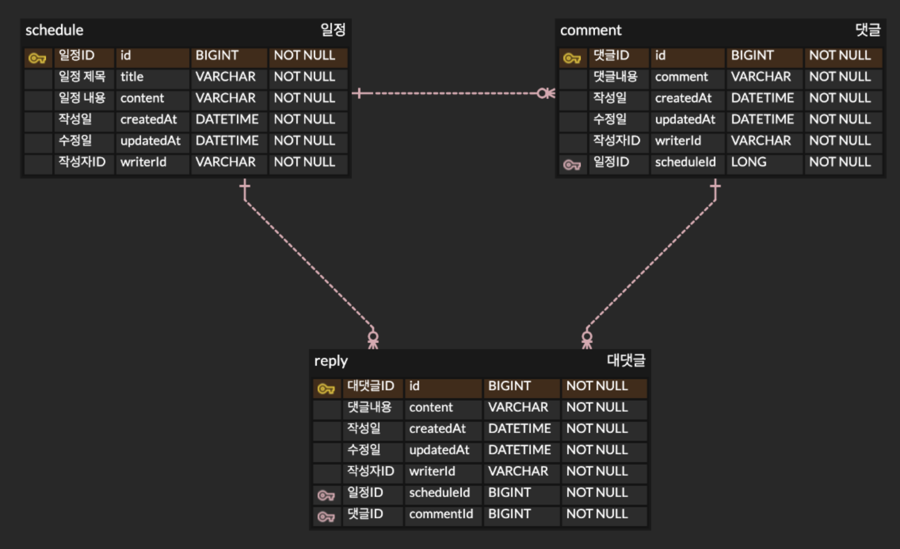

# 📅 Schedule API

Spring 기반의 일정 관리 시스템 API입니다.  
일정(Schedule), 댓글(Comment), 대댓글(Reply)에 대한 CRUD 기능을 제공합니다.

## 🛠️ 기술 스택

- Java
- Spring Framework (Spring Boot)
- RESTful API

---

## 📅 일정 관리 API 명세서

### ✅ 일정 (Schedule)

| 기능명       | Method | URL                       | Request Body                                                                 | Response Body                                                                                                             | 상태 코드         | 예외 처리                                                                 |
|--------------|--------|---------------------------|-------------------------------------------------------------------------------|---------------------------------------------------------------------------------------------------------------------------|-------------------|----------------------------------------------------------------------------|
| 일정 생성     | POST   | `/schedules`              | `{ "title": "제목1", "content": "내용1", "writerId": "아이디" }`              | `{ "title": "제목1", "content": "내용1", "writerId": "아이디", "createdAt": "작성일" }`                                    | 201 Created       | 400 Bad Request `{ "msg": "필수 항목이 누락되었습니다." }`                 |
| 일정 전체 조회 | GET    | `/schedules`              | -                                                                             | `[ { "title": "...", "content": "...", "writerId": "...", "createdAt": "...", "commentCount": 1 }, ... ]`               | 200 OK            | -                                                                          |
| 일정 단건 조회 | GET    | `/schedules/{scheduleId}` | -                                                                             | `{ "title": "...", "content": "...", "writerId": "...", "createdAt": "...", "comments": [ { "comment": "...", ... } ] }` | 200 OK / 204 No Content | -                                                                      |
| 일정 수정     | PATCH  | `/schedules/{scheduleId}` | `{ "writerId": "작성자", "title": "수정된 제목", "content": "수정된 내용" }`   | `{ "title": "수정된 제목", "content": "수정된 내용", "updatedAt": "수정일" }`                                             | 200 OK            | 403 Forbidden `{ "msg": "수정 권한이 없습니다." }`                         |
| 일정 삭제     | DELETE | `/schedules/{scheduleId}` | -                                                                             | `{ "meg": "삭제 완료" }`                                                                                                  | 204 No Content    | 403 Forbidden `{ "msg": "삭제 권한이 없습니다." }`                         |

---

### 💬 댓글 (Comment)

| 기능명       | Method | URL                                      | Request Body                                             | Response Body                                                   | 상태 코드         | 예외 처리                                                                 |
|--------------|--------|------------------------------------------|-----------------------------------------------------------|------------------------------------------------------------------|-------------------|----------------------------------------------------------------------------|
| 댓글 생성     | POST   | `/schedules/{scheduleId}/comments`       | `{ "writerId": "작성자", "comment": "댓글 내용" }`         | `{ "comment": "댓글 내용", "createdAt": "작성일" }`             | 201 Created       | 400 Bad Request `{ "msg": "필수 항목이 누락되었습니다." }`                 |
| 댓글 전체 조회 | GET    | `/schedules/{scheduleId}/comments`       | -                                                         | `[ { "comment": "댓글1", "writerId": "아이디" }, ... ]`          | 200 OK            | -                                                                          |
| 댓글 단건 조회 | GET    | `/schedules/{scheduleId}/comments/{id}`  | -                                                         | `{ "comment": "댓글1", "writerId": "아이디" }`                  | 200 OK / 204 No Content | -                                                                    |
| 댓글 수정     | PATCH  | `/schedules/{scheduleId}/comments/{id}`  | `{ "writerId": "작성자", "comment": "수정된 댓글" }`       | `{ "comment": "수정된 댓글", "updatedAt": "수정일" }`           | 200 OK            | 403 Forbidden `{ "msg": "수정 권한이 없습니다." }`                         |
| 댓글 삭제     | DELETE | `/schedules/{scheduleId}/comments/{id}`  | -                                                         | `{ "meg": "삭제 완료" }`                                        | 204 No Content    | 403 Forbidden `{ "msg": "삭제 권한이 없습니다." }`                         |

---

### 🔁 대댓글 (Reply)

| 기능명       | Method | URL                                                                 | Request Body                                                | Response Body                                                                                      | 상태 코드         | 예외 처리                                                                 |
|--------------|--------|----------------------------------------------------------------------|--------------------------------------------------------------|-------------------------------------------------------------------------------------------------------|-------------------|----------------------------------------------------------------------------|
| 대댓글 생성   | POST   | `/schedules/{scheduleId}/comments/{commentId}/replies`                | `{ "writerId": "작성자", "reply": "대댓글 내용" }`           | `{ "reply": "대댓글 내용", "createdAt": "작성일" }`                                                  | 201 Created       | 400 Bad Request `{ "msg": "필수 항목이 누락되었습니다." }`                 |
| 대댓글 전체 조회 | GET    | `/schedules/{scheduleId}/comments/{commentId}/replies`              | -                                                            | `[ { "comment": "...", "commentWriterId": "...", "reply": "...", "replyWriterId": "..." }, ... ]`   | 200 OK            | -                                                                          |
| 대댓글 단건 조회 | GET    | `/schedules/{scheduleId}/comments/{commentId}/replies/{replyId}`    | -                                                            | `{ "comment": "...", "commentWriterId": "...", "reply": "...", "replyWriterId": "..." }`            | 200 OK / 204 No Content | -                                                                    |
| 대댓글 수정   | PATCH  | `/schedules/{scheduleId}/comments/{commentId}/replies/{replyId}`    | `{ "writerId": "작성자", "reply": "수정된 대댓글" }`         | `{ "reply": "수정된 대댓글", "updatedAt": "수정일" }`                                               | 200 OK            | 403 Forbidden `{ "msg": "수정 권한이 없습니다." }`                         |
| 대댓글 삭제   | DELETE | `/schedules/{scheduleId}/comments/{commentId}/replies/{replyId}`    | -                                                            | `{ "meg": "삭제 완료" }`                                                                             | 204 No Content    | 403 Forbidden `{ "msg": "삭제 권한이 없습니다." }`                         |

---

## 📌 ERD

